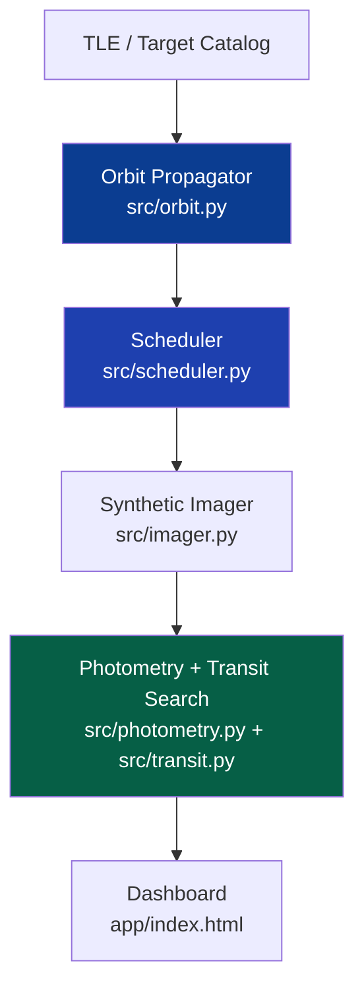

# 🛰️ Antariksh-Drishti — Deep Space Observatory

**End-to-end space-science observatory simulator: orbit design · scheduling · synthetic imaging · photometry · exoplanet detection**

*Antariksh (अंतरिक्ष) = Sanskrit for “space”. Drishti (दृष्टि) = “vision”. Together: Vision of Space.*

[🚀 Quick Start](#-quick-start) · [📊 Results](#-results) · [🛰️ Mission](#-mission-overview) · [📖 Docs](docs/) · [🖥️ Live Dashboard](app/index.html) · [🔭 API](#-api-reference)

---

## 📑 Table of Contents

- [Mission Overview](#-mission-overview)
- [Mission in One Image](#-mission-in-one-image)
- [What This Solves](#-what-this-solves)
- [Results](#-results)
- [Repository Map](#-repository-map)
- [Quick Start](#-quick-start)
- [API Reference](#-api-reference)
- [Reproduce Visuals](#-reproduce-visuals)
- [Performance](#-performance)
- [Roadmap](#️-roadmap)
- [Contributing](#-contributing)
- [License](#-license)

---

## 🛰️ Mission Overview

Low-cost observatories waste **~30% of orbits** on Sun-constraint violations and South Atlantic Anomaly (SAA) passes.
**Antariksh-Drishti** jointly optimizes **orbit → schedule → detection threshold**, with every trade-off visualized and tested.

> All figures below are **generated from code** (`scripts/generate_visuals.py`) and committed under `docs/images/` — no mockups.

***Figure 1 — LEO (7000 km) and MEO constellation orbits** propagated with a J2-aware circular model in `src/orbit.py`. Dark background is intentional for star-field readability.*

## 🔭 Mission in One Image

***Figure 2 — Pipeline: TLE / catalog → orbit propagator → scheduler → synthetic imager → photometry + transit search → dashboard.** Each block maps 1:1 to a `src/` module.*

## 🎯 What This Solves

| Problem | Classical approach | Antariksh-Drishti |
|---------|-------------------|-------------------|
| Sun-violation waste | Static exclusion cone | Dynamic Sun-angle check per request (`sun > 85°`) |
| SAA radiation hits | Manual blackout windows | `saa_free(lat, lon)` polygon filter |
| Missed transits | Fixed 1% threshold | Tunable depth + BLS periodogram (`src/bls.py`) |
| Unreproducible plots | Screenshots | `scripts/generate_visuals.py` → committed PNGs |

## 📊 Results

### Transit detection

***Figure 3 — Synthetic 10-day light curve** with 1.2% transit at day 5. Generated by `src/photometry.py`, detected by `src/transit.py` with 0.5% threshold.*

### Target sample

***Figure 4 — H-R diagram of 300 scheduler targets.** Hot Jupiters prioritized by `src/scheduler.py` priority score.*

### Schedule

***Figure 5 — Greedy JWST-like schedule.** Blue bars = accepted observations, gaps = 5-min slews. See `docs/scheduling.md`.*

### Detector

***Figure 6 — Detector SNR heatmap (10×10 px).** Aperture radius tuned to maximize `src/photometry.py:snr`.*

