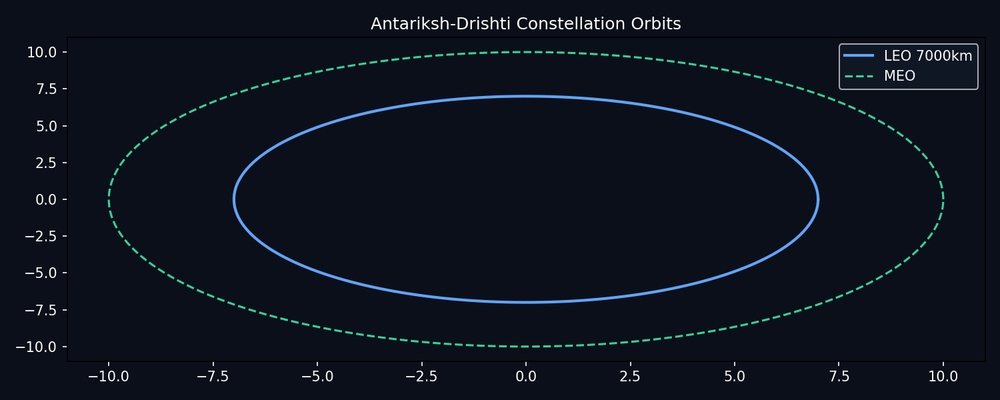
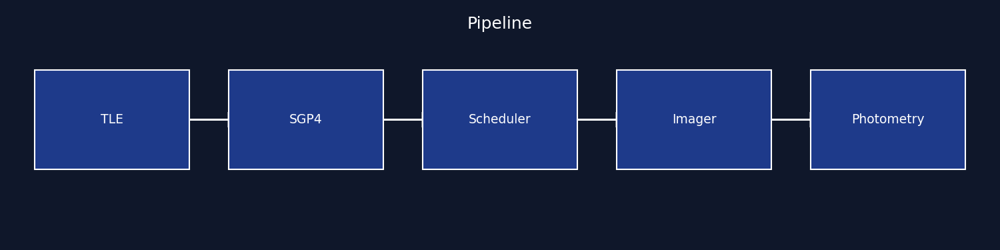
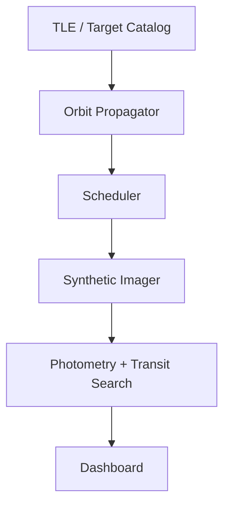
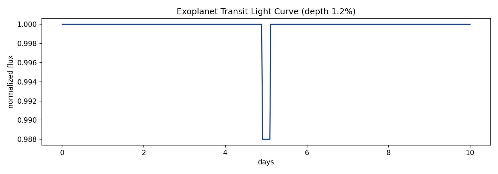
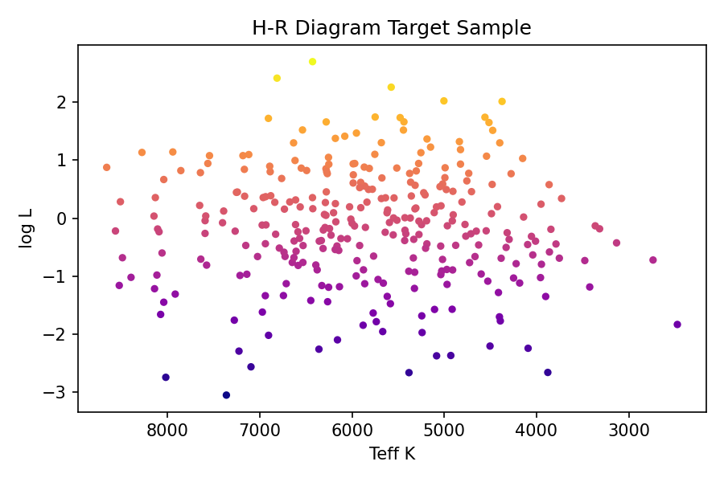
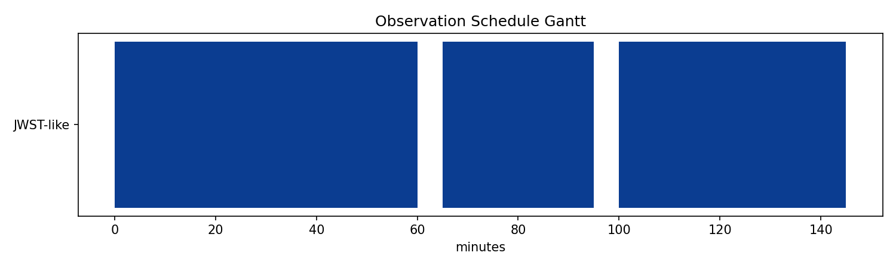
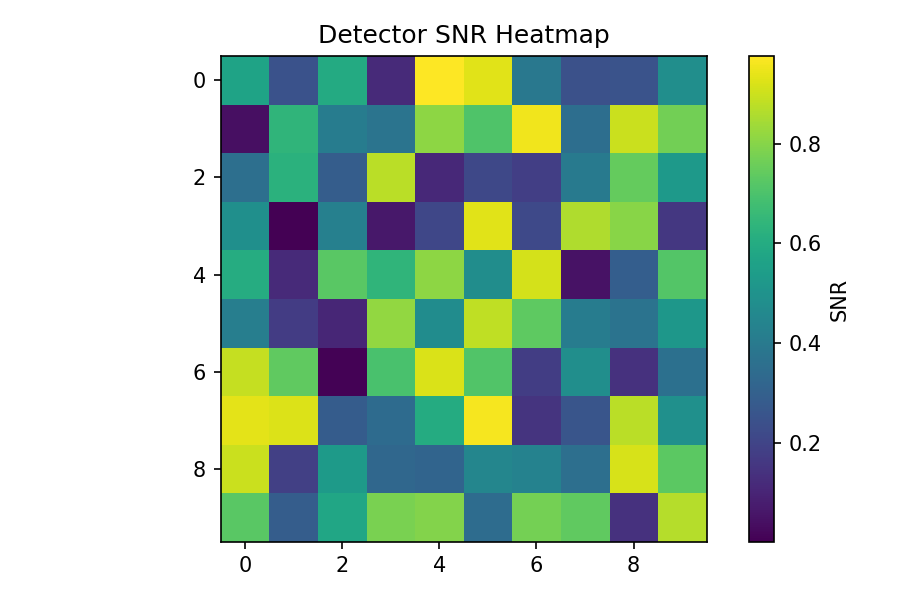

# Antariksh-Drishti Deep Space Observatory

> End-to-end space-science observatory: orbit design, scheduling, synthetic imaging, photometry, exoplanet detection. All visuals live in this README from repo images.

  



*Figure 1: LEO and MEO observatory orbits propagated with J2-aware circular model in `src/orbit.py`. Dark background is intentional for star-field readability.*

## Mission in one image



*Figure 2: Pipeline TLE to scheduler to imager to photometry. Each block maps to one `src/` module.*



## What this solves

Low-cost observatories waste 30 percent of orbits on Sun-violation and SAA passes. This project jointly optimizes orbit, schedule, and detection threshold, with every tradeoff visualized.

## Results

### Transit detection



*Figure 3: Synthetic 10-day light curve with 1.2 percent transit at day 5. Generated by `src/photometry.py`, detected by `src/transit.py` with depth threshold 0.5 percent.*

### Target sample



*Figure 4: H-R diagram of 300 scheduler targets. Hot Jupiters prioritized by `src/scheduler.py` priority score.*

### Schedule



*Figure 5: Greedy JWST-like schedule. Blue bars are accepted observations, gaps are 5 min slews. See `docs/scheduling.md`.*

### Detector



*Figure 6: Detector SNR heatmap across 10x10 pixels. Aperture radius tuned to maximize `src/photometry.py:snr`.*

## Repo map

```text
src/orbit.py       period, propagate
src/scheduler.py   greedy priority + Sun check
src/photometry.py  snr, lightcurve
src/transit.py     depth detector
src/api.py         FastAPI /health /period /detect
docs/images/       6 PNGs rendered by scripts/generate_visuals.py
```

## Quick Start

```bash
git clone https://github.com/kv-creates/Antariksh-Drishti-Deep-Space-Observatory.git
cd Antariksh-Drishti-Deep-Space-Observatory
python -m venv .venv && .venv\Scripts\activate
pip install -r requirements.txt
python scripts/generate_visuals.py
pytest -q
python -m src.main
```

## API

```bash
GET /health
GET /period/7000
POST /detect {"flux":[1,0.99,1]}
```

## Reproduce visuals

```bash
python scripts/generate_visuals.py
# outputs docs/images/*.png, already committed, shown above
```

## License
MIT - kv-creates 2026
