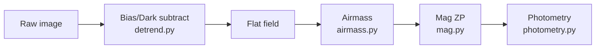

# 🎛️ Calibration

1. **Bias/dark** — subtract median (`src/detrend.py:median_detrend`)
2. **Flat** — normalize by sky median
3. **Airmass** — `src/airmass.py:airmass(alt)` plane-parallel, clamp ≥5°
4. **Zero-point** — `src/mag.py:flux_to_mag` Pogson scale
5. **Exposure** — `src/exposure.py:exptime(snr, flux)` + `coadds_needed`

Validate with `scripts/validate.py`.

## Flow

